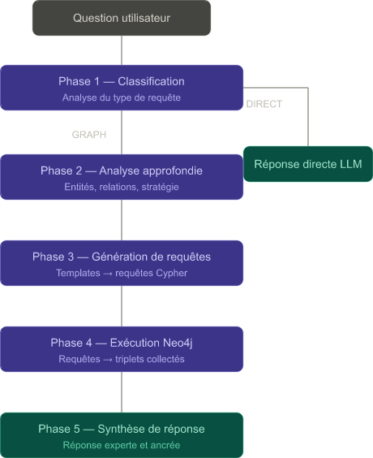

## Hetionet Biomedical Assistant

A conversational AI assistant with deep reasoning capabilities that explores the **Hetionet biomedical knowledge graph** to answer complex questions about diseases, genes, compounds, anatomy, and their relationships.

Built with **Streamlit**, **Mistral AI**, and **Neo4j**.

---

##  Architecture




---

##  Prerequisites

- Python 3.10+
- A running **Neo4j** instance (local or cloud) with the Hetionet dataset loaded
- A **Mistral AI** API key → [Get one free](https://console.mistral.ai/)
- The Neo4j vector index `entity_embeddings` must exist (see setup below)

---

##  Installation

### 1. Clone the repository

```bash
git clone https://github.com/TARIK-SENHAJI/hetionet-assistant.git
cd hetionet-assistant
```

### 2. Create and activate a virtual environment

```bash
python -m venv venv
source venv/bin/activate        # Linux / macOS
venv\Scripts\activate           # Windows
```

### 3. Install dependencies

```bash
pip install -r requirements.txt
```

### 4. Configure environment variables

```bash
cp .env.example .env
```

Then edit `.env` with your credentials:

```env
NEO4J_URI=bolt://localhost:7687
NEO4J_USERNAME=neo4j
NEO4J_PASSWORD=your_password
MISTRAL_API_KEY=your_mistral_key
```

### 5. (First time only) Build vector embeddings

This script populates the `embedding` property on all `Entity` nodes in Neo4j using `mistral-embed`. Run it once before launching the app:

```bash
python build_embeddings.py
```

>  This can take several minutes depending on the number of nodes. It is safe to interrupt and re-run — already-embedded nodes are skipped.

After running, create the vector index in Neo4j (run in Neo4j Browser):

```cypher
CREATE VECTOR INDEX entity_embeddings IF NOT EXISTS
FOR (n:Entity) ON (n.embedding)
OPTIONS {indexConfig: {`vector.dimensions`: 1024, `vector.similarity_function`: 'cosine'}}
```

### 6. Launch the app

```bash
streamlit run app.py
```

The app will open at `http://localhost:8501`.

---

##  Example Questions

| Question | Pipeline Used |
|---|---|
| `What genes are associated with Asthma?` | Graph multi-query |
| `What compounds treat Parkinson's disease?` | Graph multi-query |
| `J'ai du mal à respirer, quelles maladies ?` | Semantic search (French) |
| `What symptoms does Multiple Sclerosis present?` | Graph multi-query |
| `Find genes shared between Alzheimer and Diabetes` | Shared mechanisms template |
| `Hello, how are you?` | Direct answer |

---

##  Query Templates

The system routes questions to one of 5 Cypher query templates:

| Template | Description |
|---|---|
| `explore_specific` | Find entities of a specific type connected to a main entity |
| `find_connection` | Check direct relationship between two entities |
| `drug_repurposing` | Compound → Gene → Disease multi-hop path |
| `shared_mechanisms` | Find shared nodes between two entities |
| `biomarker_discovery` | Gene connected to both a disease and a symptom |
| `semantic_search` | Vector similarity search for vague or non-English queries |

---

##  Hetionet Relationship Reference

| Code | Meaning |
|---|---|
| `CtD` | Compound **treats** Disease |
| `CpD` | Compound **palliates** Disease |
| `CbG` | Compound **binds** Gene |
| `CuG` | Compound **upregulates** Gene |
| `DaG` | Disease **associates** Gene |
| `DdG` | Disease **downregulates** Gene |
| `DpS` | Disease **presents** Symptom |
| `DlA` | Disease **localizes to** Anatomy |
| `GiG` | Gene **interacts** Gene |
| `DrD` | Disease **resembles** Disease |
| `CrC` | Compound **resembles** Compound |

---

##  Tech Stack

| Component | Technology |
|---|---|
| UI | Streamlit 1.56.0 |
| LLM & Embeddings | Mistral AI 1.9.7 (`open-mistral-7b`, `open-mistral-8x7b`, `mistral-small-latest`, `mistral-embed`) |
| Graph Database | Neo4j 6.1.0 |
| Knowledge Graph | [Hetionet](https://het.io/) |

---

##  License

MIT License — see `LICENSE` for details.
